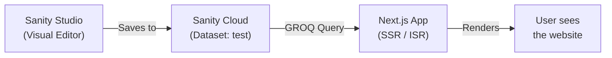
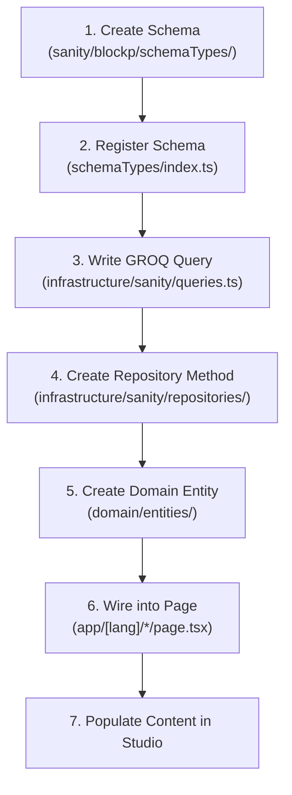

# Making Every BlockP Page Editable via Sanity CMS

A complete, beginner-friendly, end-to-end guide.

---

## Part 1 — How Sanity Works (The Basics)

### What is Sanity?

Sanity is a **headless CMS** — it stores your content (text, images, settings) in a cloud database, and gives you a visual editor (called **Sanity Studio**) where non-technical team members can change content without touching code. Your Next.js website then **fetches** that content at build/render time and displays it.

### Key Concepts

| Concept | What it means |
|---|---|
| **Project** | Your Sanity account. Yours is `pl6zt5cf`. |
| **Dataset** | A named database inside the project. Yours is `test`. Think of it like a separate environment (you could later add `production`). |
| **Schema** | A TypeScript file that defines the *shape* of a content type. Like a database table definition. E.g., your [footer.ts](file:///d:/Arpit%20chunks/blockp/blockp-website/sanity/blockp/schemaTypes/footer.ts) schema defines what fields the footer has. |
| **Document** | A single record/entry of a schema type. E.g., one `footer` document, one `product` document for "Android". |
| **Singleton** | A document type where only **one** instance exists (e.g., "Homepage", "Footer"). You edit it, not create multiples. |
| **GROQ** | Sanity's query language (like SQL but for JSON). You write GROQ queries to fetch data. E.g., `*[_type == "footer"][0]` fetches the single footer document. |
| **Sanity Studio** | The visual admin panel your team uses. It runs from [sanity/blockp/](file:///d:/Arpit%20chunks/blockp/blockp-website/sanity/blockp/) using `npx sanity dev`. |
| **Sanity Client** | The code in your Next.js app that talks to the Sanity API. Yours is at [infrastructure/sanity/client.ts](file:///d:/Arpit%20chunks/blockp/blockp-website/infrastructure/sanity/client.ts). |

### How the Data Flow Works



1. Your team opens Sanity Studio → edits content (text, images, etc.)
2. Content is saved to Sanity's cloud database
3. When a user visits your website, Next.js runs a GROQ query to fetch the latest content
4. The page renders with the live content

---

## Part 2 — Your Current Setup Audit

### What's Already Sanity-Powered ✅

| Feature | Schema | Query | Repository | Used in Page |
|---|---|---|---|---|
| Blog Posts | `post.ts` + `postMetadata.ts` | `POST_BY_SLUG_QUERY`, etc. | `SanityPostRepository` | `[lang]/blog/*` |
| Footer | `footer.ts` | `FOOTER_QUERY` | `SanitySiteRepository` | Global footer component |
| Site Settings | `siteSettings.ts` | `SITE_SETTINGS_QUERY` | — | Navbar |
| Product Pages (partial) | `product.ts` | `PRODUCT_BY_SLUG_QUERY` | — | `[lang]/products/[slug]` |

### What's Still Hardcoded ❌

| Page | Route | Content Source |
|---|---|---|
| **Homepage** | `[lang]/page.tsx` | 649 lines of hardcoded JSX — hero text, stats, testimonials, FAQs, "stop watching" cards, footer |
| **Premium** | `[lang]/premium/page.tsx` | Uses `pageTranslations.ts` for some strings, but pricing, features list, comparison table are hardcoded |
| **Android Product** | `[lang]/products/android/page.tsx` | Hero text, premium section text hardcoded. Scroll UI steps hardcoded in `AndroidScrollUI.tsx` |
| **Chrome Product** | `[lang]/products/chrome/page.tsx` | Same pattern as Android |
| **iOS Product** | `[lang]/products/ios/page.tsx` | Hardcoded |
| **macOS Product** | `[lang]/products/macos/page.tsx` | Hardcoded |
| **Windows Product** | `[lang]/products/microsoft/page.tsx` | Hardcoded |
| **FAQs** | `[lang]/faqs/page.tsx` | Uses `pageTranslations.ts` |
| **Addiction Test** | `[lang]/addiction-test/page.tsx` | Uses `pageTranslations.ts` |
| **Privacy Policy** | `[lang]/privacy-policy/page.tsx` | Hardcoded or translations |
| **Terms & Conditions** | `[lang]/terms-and-conditions/page.tsx` | Hardcoded or translations |
| **Data Deletion** | `[lang]/data-deletion/page.tsx` | Uses `pageTranslations.ts` |
| **Fact Checked** | `[lang]/fact-checked/page.tsx` | Hardcoded |
| **Medical Professionals** | `[lang]/medical-professionals/page.tsx` | Hardcoded |

### Your Translation Approach

Currently you have a massive [pageTranslations.ts](file:///d:/Arpit%20chunks/blockp/blockp-website/lib/pageTranslations.ts) (321 lines) that stores translations for 4 languages (en, es, fr, hi). This is fragile — every content change requires a code deploy. Moving this to Sanity means your team can edit translations directly in the Studio.

---

## Part 3 — The Migration Plan (6 Phases)

### Phase 1: Foundation — Singleton Pages

**Goal:** Make the Homepage, Premium page, and FAQ page editable.

**Why start here:** These are the highest-traffic pages with the most content, and they follow a "singleton" pattern (one document per page).

---

#### 1A. Homepage Schema

Create `sanity/blockp/schemaTypes/homepage.ts`:

```
Document type: "homepage" (Singleton)

Fields:
├── Hero Section
│   ├── heroTitle (string) — "BlockP: #1 Free AI porn blocker..."
│   ├── heroSubtitle (text) — "Whether you want to block porn..."
│   ├── heroCta (string) — "Download Now"
│   ├── heroCtaUrl (string) — link target
│   └── heroImage (image) — the dashboard screenshot
│
├── As Seen On
│   └── logos[] (array of objects)
│       ├── name (string) — "Google"
│       └── logo (image)
│
├── Platforms
│   ├── sectionTitle (string) — "Stay protected on all platforms"
│   └── platforms[] (array of objects)
│       ├── name (string)
│       ├── icon (image)
│       └── url (string)
│
├── Stats
│   ├── sectionTitle (string) — "Join the millions..."
│   └── stats[] (array of objects)
│       ├── icon (image)
│       ├── value (string) — "4.4 Star"
│       └── label (string) — "Average rating based on reviews"
│
├── Testimonials
│   ├── sectionTitle (string) — "What our users say about us"
│   └── testimonials[] (array of objects)
│       ├── quote (text)
│       ├── authorName (string)
│       ├── authorRole (string)
│       └── rating (number)
│
├── Stop Watching Cards
│   ├── sectionTitle (string) — "How can you stop watching porn?"
│   └── cards[] (array of objects)
│       ├── title (string)
│       ├── description (text)
│       └── image (image)
│
└── FAQ Section
    ├── sectionTitle (string) — "Have More Questions?"
    └── faqItems[] (array of objects)
        ├── question (string)
        └── answer (text)
```

#### 1B. Premium Page Schema

Create `sanity/blockp/schemaTypes/premiumPage.ts`:

```
Document type: "premiumPage" (Singleton)

Fields:
├── Hero
│   ├── title[] (array of strings) — ["BlockP", "Premium"]
│   ├── ctaText (string) — "Start your free trial"
│   └── ctaUrl (string)
│
├── Subheading (string) — "One subscription to keep you safe..."
│
├── Pricing
│   ├── freeLabel (string) — "Free forever"
│   ├── freeFeatures[] (array of strings)
│   ├── annualLabel (string) — "Annual"
│   ├── annualPrice (string) — "$29.99 / billed annually"
│   ├── monthlyLabel (string) — "Monthly"
│   ├── monthlyPrice (string) — "$4.99 / mo"
│   ├── saveLabel (string) — "Save 40%"
│   └── premiumFeatures[] (array of strings)
│
├── Comparison Table (object)
│   └── rows[] (array of objects)
│       ├── feature (string)
│       ├── freeValue (string or boolean)
│       └── premiumValue (string or boolean)
│
└── Platform Icons[] (reuse from homepage or reference)
```

#### 1C. FAQs Page Schema

Create `sanity/blockp/schemaTypes/faqsPage.ts`:

```
Document type: "faqsPage" (Singleton)

Fields:
├── title (string) — "FAQs"
├── language (string) — for i18n support
└── faqItems[] (array of objects)
    ├── question (string)
    └── answer (text)
```

> [!TIP]
> For multi-language support, you have two choices:
> 1. **One document per language** — simpler, each has a `language` field
> 2. **Localized fields** — single document with `{ en: "...", es: "..." }` per field (more complex)
>
> Option 1 is recommended since your blog already uses this pattern.

---

### Phase 2: Product Pages

**Goal:** Make all 5 product pages (Android, Chrome, iOS, macOS, Windows) fully editable.

You already have a [product.ts](file:///d:/Arpit%20chunks/blockp/blockp-website/sanity/blockp/schemaTypes/product.ts) schema with hero, store badge, and features. But the actual product pages (`android/page.tsx`, `chrome/page.tsx`, etc.) **don't use it** — they're hardcoded. We need to:

#### 2A. Extend the Existing `product.ts` Schema

Add these missing fields to the existing schema:

```
New fields to add:
├── premiumSection
│   ├── title (string) — "BlockP Premium."
│   ├── description (text) — "Stronger protection, full control..."
│   └── ctaText (string) — "Start your free trial!"
│
├── scrollSteps[] (array of objects) — for AndroidScrollUI
│   ├── title (string) — "Install BlockP"
│   ├── description (text) — "Download and install..."
│   └── image (image) — phone mockup screenshot
│
├── whySection
│   ├── title (string)
│   ├── description (text)
│   └── reasons[] (array of objects)
│       ├── icon (image)
│       ├── title (string)
│       └── description (text)
│
├── benefitsSection
│   ├── title (string)
│   └── benefits[] (array of objects)
│       ├── title (string)
│       └── description (text)
│
├── faqSection
│   └── faqItems[] (array of objects)
│       ├── question (string)
│       └── answer (text)
│
└── seo (object)
    ├── metaTitle (string)
    └── metaDescription (text)
```

#### 2B. Wire Product Pages to Sanity

For each product page (`android/page.tsx`, `chrome/page.tsx`, etc.):

1. Fetch the product document using `PRODUCT_BY_SLUG_QUERY` (extended)
2. Pass the fetched data as props to child components
3. Replace hardcoded strings with data from Sanity

#### 2C. Make AndroidScrollUI Data-Driven

Currently [AndroidScrollUI.tsx](file:///d:/Arpit%20chunks/blockp/blockp-website/components/shared/AndroidScrollUI.tsx) has a hardcoded `STEPS` array. Change it to accept `steps` as a prop:

```tsx
// Before: hardcoded
const STEPS = [{ title: "Install BlockP", ... }]

// After: prop-driven  
export function AndroidScrollUI({ steps }: { steps: Step[] }) {
```

---

### Phase 3: Legal / Static Pages

**Goal:** Make Privacy Policy, Terms & Conditions, Data Deletion, Fact Checked, and Medical Professionals pages editable.

#### 3A. Create a `legalPage` Schema

```
Document type: "legalPage"

Fields:
├── title (string) — "Privacy Policy"
├── slug (slug) — "privacy-policy"
├── language (string) — "en"
├── lastUpdated (date)
└── body (blockContent) — rich text editor (reuse your existing blockContent schema)
```

> [!IMPORTANT]
> Your existing [blockContent.ts](file:///d:/Arpit%20chunks/blockp/blockp-website/sanity/blockp/schemaTypes/blockContent.ts) schema already supports rich text with headings, lists, links, and images. Reuse it for legal pages — your team can format privacy policies with proper headings and bullet points directly in Studio.

#### 3B. Create Sanity Documents

In Sanity Studio, create one `legalPage` document per page per language:
- `privacy-policy` (en), `privacy-policy` (es), etc.
- `terms-and-conditions` (en), etc.
- `data-deletion` (en), etc.
- `fact-checked` (en), etc.
- `medical-professionals` (en), etc.

#### 3C. Update the Routes

Replace the hardcoded content in each page with a GROQ fetch:

```groq
*[_type == "legalPage" && slug.current == $slug && language == $lang][0] {
  title, lastUpdated, body
}
```

---

### Phase 4: Addiction Test Page

**Goal:** Make the addiction test questions and results editable.

#### 4A. Create `addictionTest` Schema

```
Document type: "addictionTest" (Singleton per language)

Fields:
├── language (string)
├── title (string) — "Anonymous addiction test"
├── intro (text)
├── beforeTitle (string)
├── beforeIntro (text)
├── beforeNote (string)
├── beforePoints[] (array of strings)
├── questions[] (array of strings)
└── resultMessages (object)
    ├── low (text) — message for low score
    ├── medium (text) — message for medium score
    └── high (text) — message for high score
```

---

### Phase 5: Kill `pageTranslations.ts`

**Goal:** Remove the hardcoded translations file entirely.

Once Phases 1–4 are done, the massive [pageTranslations.ts](file:///d:/Arpit%20chunks/blockp/blockp-website/lib/pageTranslations.ts) becomes unnecessary. Every page will fetch its own content from Sanity with a `language` filter.

#### Migration Steps:
1. For each page that currently calls `getPageTranslations(locale)`, replace with a Sanity fetch
2. Copy the existing translation strings into Sanity documents (one document per language per page)
3. Delete `pageTranslations.ts`
4. Update the `PageTranslations` interface in components to accept Sanity data shape

---

### Phase 6: Advanced — Studio UX & Workflow

**Goal:** Make the Sanity Studio experience polished for your team.

#### 6A. Organize Studio Sidebar

Update [sanity.config.ts](file:///d:/Arpit%20chunks/blockp/blockp-website/sanity/blockp/sanity.config.ts) structure to group pages:

```
Content
├── 📄 Pages
│   ├── Homepage
│   ├── Premium
│   ├── FAQs
│   └── Addiction Test
├── 📱 Products
│   ├── Android
│   ├── Chrome
│   ├── iOS
│   ├── macOS
│   └── Windows
├── 📝 Blog
│   ├── Posts (By Slug)
│   ├── Posts (By Language)
│   └── All Posts
├── 📜 Legal Pages
│   ├── Privacy Policy
│   ├── Terms & Conditions
│   ├── Data Deletion
│   ├── Fact Checked
│   └── Medical Professionals
├── ⚙️ Settings
│   ├── Site Settings
│   └── Footer
└── 📂 Taxonomies
    ├── Authors
    └── Categories
```

#### 6B. Add Live Preview (Optional)

Sanity supports real-time preview — your team can see changes live on the website before publishing. This requires:
- Setting up `@sanity/preview-kit`
- Adding a preview route in Next.js
- Configuring draft mode

#### 6C. Role-Based Access (Optional)

Set up roles in Sanity so that:
- **Editors** can change content but not delete schemas
- **Admins** have full access
- **Viewers** can only read

---

## Part 4 — Implementation Checklist

### For Each Page, the Pattern Is Always:



### Per-Phase File Changes Summary

| Phase | New/Modified Files |
|---|---|
| **Phase 1** | `schemaTypes/homepage.ts` [NEW], `schemaTypes/premiumPage.ts` [NEW], `schemaTypes/faqsPage.ts` [NEW], `schemaTypes/index.ts` [MODIFY], `queries.ts` [MODIFY], `repositories/` [MODIFY], `app/[lang]/page.tsx` [MODIFY], `app/[lang]/premium/page.tsx` [MODIFY], `app/[lang]/faqs/page.tsx` [MODIFY] |
| **Phase 2** | `schemaTypes/product.ts` [MODIFY], `queries.ts` [MODIFY], `AndroidScrollUI.tsx` [MODIFY], `app/[lang]/products/android/page.tsx` [MODIFY], + all other product pages |
| **Phase 3** | `schemaTypes/legalPage.ts` [NEW], `schemaTypes/index.ts` [MODIFY], `queries.ts` [MODIFY], `app/[lang]/privacy-policy/page.tsx` [MODIFY], + all legal pages |
| **Phase 4** | `schemaTypes/addictionTest.ts` [NEW], `schemaTypes/index.ts` [MODIFY], `queries.ts` [MODIFY], `app/[lang]/addiction-test/page.tsx` [MODIFY] |
| **Phase 5** | `lib/pageTranslations.ts` [DELETE] |
| **Phase 6** | `sanity.config.ts` [MODIFY] |

---

## Part 5 — Quick Reference: GROQ Query Patterns

### Singleton Fetch (Homepage, Premium, etc.)
```groq
// Fetch the single homepage document
*[_type == "homepage"][0] {
  heroTitle,
  heroSubtitle,
  heroCta,
  "heroImageUrl": heroImage.asset->url,
  stats[] { "iconUrl": icon.asset->url, value, label },
  testimonials[] { quote, authorName, authorRole, rating },
  ...
}
```

### Language-Filtered Fetch
```groq
// Fetch FAQs for a specific language
*[_type == "faqsPage" && language == $lang][0] {
  title,
  faqItems[] { question, answer }
}
```

### Product Fetch (Extended)
```groq
*[_type == "product" && slug.current == $slug][0] {
  name,
  heroTitle,
  "heroImageUrl": heroImage.asset->url,
  scrollSteps[] { title, description, "imageUrl": image.asset->url },
  premiumSection { title, description, ctaText },
  faqSection { faqItems[] { question, answer } },
  seo { metaTitle, metaDescription }
}
```

---

## Part 6 — How to Run & Test

### Running Sanity Studio Locally
```bash
cd sanity/blockp
npx sanity dev
# Opens at http://localhost:3333
```

### Running the Website Locally
```bash
npm run dev
# Opens at http://localhost:3000
```

### Testing the Flow
1. Open Sanity Studio → create/edit a document
2. Save/publish the document
3. Refresh your Next.js page → content should update

> [!CAUTION]
> **CDN Caching**: In production, `useCdn: true` means content updates may take up to 60 seconds to appear. During development, `useCdn: false` gives instant updates. Your current setup already handles this correctly in [client.ts](file:///d:/Arpit%20chunks/blockp/blockp-website/infrastructure/sanity/client.ts).

---

## Recommended Execution Order

> [!IMPORTANT]
> **Start with Phase 1** (Homepage). It's the single most impactful page and will establish the pattern for everything else. Once your team sees the Homepage editable in Studio, they'll understand the value immediately.

| Priority | Phase | Effort | Impact |
|---|---|---|---|
| 🔴 High | Phase 1: Homepage + Premium + FAQs | ~2-3 days | Highest traffic pages become editable |
| 🟠 Medium | Phase 2: Product Pages | ~2 days | 5 product pages become editable |
| 🟡 Medium | Phase 3: Legal Pages | ~1 day | Legal compliance pages editable |
| 🟢 Low | Phase 4: Addiction Test | ~0.5 day | Niche page, lower traffic |
| 🔵 Cleanup | Phase 5: Kill translations file | ~0.5 day | Remove technical debt |
| ⚪ Polish | Phase 6: Studio UX | ~1 day | Better team experience |
